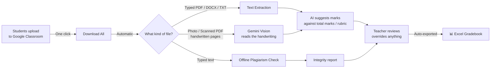

# 🎯 The Agenda

> **Give teachers their evenings back.**

---

## 😓 The Problem

Every assignment is the same painful ritual:

A teacher announces an assignment in class. Students upload photos of handwritten pages, PDFs, documents — into Google Classroom. Then the deadline passes, and the real work begins.

The teacher opens **file after file after file**. Forty students. Seventy students. Each one opened by hand, read on a screen, compared against the question paper, scored in their head, and typed into an Excel sheet.

It takes **hours**. Often the teacher takes this work **home**. Eyes burning from screens. Evenings gone. Weekends gone.

That is time taken away from:
- 📚 Learning new skills
- 👨‍👩‍👧 Family
- 😴 Rest
- 🎓 Actually *teaching* better

And here's the worst part: **none of it needs human creativity.** Opening a file, reading what the student wrote, checking it against the question — that is mechanical work. It deserves a machine.

---

## 💡 What is GCR Simplified?

**GCR Simplified is a desktop app that does the mechanical part of assignment evaluation, so the teacher only does the human part — judgement.**

It sits on top of Google Classroom (where students already upload their work). With a few clicks it:

1. **Downloads** every student's submission automatically
2. **Reads** the files — typed PDFs, Word documents, text files, **and even photos of handwritten pages**
3. **Checks** who copied from whom (offline plagiarism detection)
4. **Suggests marks** for every student against the assignment's total marks or your rubric
5. **Hands you a ready-made Excel gradebook** — with class name, assignment name, registration numbers, and marks

The teacher reviews the suggested marks, changes any they disagree with, approves, and is done.

**What used to take 4–6 hours now takes 5–10 minutes.**

---

## 🔄 How It Works

### Step by step, what the teacher actually does:

| Step | Action | Time |
|------|--------|------|
| 1 | Open the app, pick your class and assignment | 10 sec |
| 2 | Click **Download & extract** | ~20 sec |
| 3 | *(Optional)* Run the plagiarism check | instant |
| 4 | Click **Grade All (AI)** and watch progress | few minutes |
| 5 | Review suggested marks, override any with one click | your judgement |
| 6 | Excel file appears automatically — ready to submit | done ✅ |

---

## ✨ What's Implemented Today

### 📥 Ingestion & Reading
- One-click batch download of all submissions from Google Classroom
- Reads **typed PDF, DOCX, TXT, MD, code files** (pure local parsing — instant)
- Reads **photos and scanned PDFs of handwritten pages** via Gemini Vision (JPG, PNG, WEBP, HEIC)
- Google Docs & Sheets auto-converted to PDF
- Smart filename reading: if students write their **name / registration number** in the filename (`Udbhav_RA2511026010418.pdf`), the app detects it and cross-checks it against the roster ✓

### 🔍 Integrity (Plagiarism)
- Fully offline detection between classmates
- Two engines: fingerprint matching (copied blocks) + semantic similarity (paraphrased copying)
- Side-by-side viewer showing exactly which text matched

### 🤖 AI Evaluation
- Grades against the assignment's **total marks from Google Classroom automatically** — no setup needed for simple assignments
- Or against a custom multi-criterion rubric when you want detailed scoring
- Every AI score is marked **"Suggested"** until you approve it
- One-click override on any score — teacher judgement always wins
- Handwritten submissions are labelled **"Handwritten"** so you always know how each one was graded

### 📊 The Excel Gradebook (auto-generated)
Four sheets, formatted and ready to submit:
1. **Summary** — class name, assignment, averages, submission rate
2. **Grade Sheet** — student names, registration numbers, marks per criterion, totals, Typed/Handwriting mode
3. **Integrity Report** — flagged similarity pairs, colour-coded
4. **Feedback Log** — AI-written feedback per student

---

## 🛡️ Why Teachers Can Trust It

### 1. The teacher is always the final authority
No mark becomes official until the teacher approves it. AI scores are suggestions, clearly labelled. Overriding is one click. The app never uploads grades back to Google Classroom without you.

### 2. Student data stays local
Files are downloaded to the teacher's own computer. Plagiarism analysis runs 100% offline on the device. Nothing goes to any server except the AI grading request itself — and credentials live in the OS Keychain, never in plaintext.

### 3. Honest about handwriting
Handwritten-photo grading is labelled everywhere — in the app and in the Excel. If a photo is unreadable, the AI is instructed to say so rather than guess. And because vision grading costs more, the app only uses it when there is genuinely no readable text.

### 4. Free to run
Built to run comfortably on the **free tier** of the Gemini API. A full class of 70 handwritten assignments fits easily within free daily limits. No subscriptions, no per-teacher fees.

### 5. Verification built in
Filename identity checks (✓ / ⚠ flags) catch swapped or wrong-file uploads before marks go into the register.

---

## 👩‍🏫 Who Is This For?

- School and college teachers who evaluate assignments on Google Classroom
- Institutions where students submit **photos of handwritten work**
- Any educator who wants the machine to do the copying-pasting-opening-scrolling, and wants to spend their time on teaching, family, and themselves

---

## 🚀 Getting Started

Teachers: download the installer from [GitHub Releases](https://github.com/Udbhav7002/GCR_Simplified/releases). On first launch, connect Google Classroom and paste a free Gemini key on the same screen — no Google Cloud Console. Full notes live in [SHARE_WITH_TEACHER.md](SHARE_WITH_TEACHER.md).

---

  <strong>The machine opens the files. The teacher makes the call.</strong>

