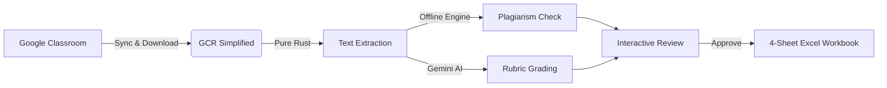

<div align="center">

# 📚 GCR Simplified
### **Grade · Check · Report — Simplified**

*A local-first, privacy-focused desktop power tool that automates assignment evaluation, intra-class plagiarism detection, AI grading, and Excel gradebook generation on top of Google Classroom.*

[](https://tauri.app/)
[](https://www.rust-lang.org/)
[](https://react.dev/)
[](https://www.typescriptlang.org/)
[](https://tailwindcss.com/)
[](https://github.com/Udbhav7002/GCR_Simplified/releases)
[](LICENSE)

---

**[Key Features](#-key-features)** •
**[Why GCR Simplified?](#-why-gcr-simplified)** •
**[Teacher Workflow](#-teacher-workflow)** •
**[Getting Started](#-getting-started)** •
**[Google Cloud Setup](#-google-cloud-console-setup)** •
**[Architecture](#-system-architecture)** •
**[Privacy & Security](#-privacy--ferpa-compliance)**

---

</div>

<br/>

## 🌟 Overview

Teachers spend upwards of **140+ hours per academic year** just marking assignments. Grading requires opening dozens of browser tabs, cross-referencing rubrics, manually looking for copied student work, and copy-pasting numbers into spreadsheets.

**GCR Simplified** eliminates this repetitive mechanical burden by sitting **directly on top of Google Classroom**:
* **Students don't need any new app:** They submit their PDFs, DOCX files, and Google Docs on Google Classroom as usual.
* **Teachers get superpowers:** One-click batch sync, automated multi-format text extraction, offline peer-to-peer plagiarism checking, AI-assisted rubric grading via Google Gemini, and instant 4-sheet formatted Excel gradebooks.
* **Local-First & Private:** Submissions, extracted text, and similarity analysis are processed **100% locally on your machine**.

---

## 📥 Download (for Teachers)

**Latest release:** [v0.1.1 on GitHub Releases](https://github.com/Udbhav7002/GCR_Simplified/releases/tag/v0.1.1)

| Your Mac | Download |
|----------|----------|
| **Apple Silicon (M1/M2/M3/M4/M5)** | [`GCR.Simplified_0.1.1_aarch64.dmg`](https://github.com/Udbhav7002/GCR_Simplified/releases/download/v0.1.1/GCR.Simplified_0.1.1_aarch64.dmg) |
| **Intel Mac** | [`GCR.Simplified_0.1.1_x64.dmg`](https://github.com/Udbhav7002/GCR_Simplified/releases/download/v0.1.1/GCR.Simplified_0.1.1_x64.dmg) |

> **Not sure which Mac you have?** Click the Apple menu ▸ **About This Mac**. If it shows "Chip: Apple M1/M2/M3/M4" → use the **aarch64** file. If it shows an Intel processor → use the **x64** file.

**First-time install (macOS Gatekeeper):**
1. Open the `.dmg` and drag **GCR Simplified** to your **Applications** folder.
2. **Right-click** the app in Applications ▸ choose **Open** ▸ click **Open** again.
3. After this one time, it opens normally like any app.

*Windows & Linux installers (`.exe`/`.msi`/`.deb`/`.AppImage`) are also available on the [releases page](https://github.com/Udbhav7002/GCR_Simplified/releases/tag/v0.1.1).*

---

## 🚀 Key Features

<table>
  <tr>
    <td width="50%">
      <h3>🔄 Google Classroom Sync</h3>
      <ul>
        <li>Secure OAuth 2.0 PKCE desktop login with auto-refresh.</li>
        <li>Live sync for active courses, rosters, and assignments.</li>
        <li><b>Missing Submissions Tracker:</b> Instant list of non-submitters with one-click Gmail reminder nudges.</li>
      </ul>
    </td>
    <td width="50%">
      <h3>📥 Parallel Ingestion & Extraction</h3>
      <ul>
        <li>High-speed batch file downloads with bounded concurrency.</li>
        <li>Google Docs & Sheets auto-exported to PDF via Drive API v3.</li>
        <li><b>Pure Rust Parsers:</b> Instant text extraction for <code>PDF</code>, <code>DOCX</code>, plain text, and code files.</li>
        <li>Persistent SQLite extraction caching.</li>
      </ul>
    </td>
  </tr>
  <tr>
    <td width="50%">
      <h3>🔍 Offline Plagiarism Engine</h3>
      <ul>
        <li><b>Winnowing Fingerprinting:</b> $k$-gram hashing for verbatim copied blocks.</li>
        <li><b>TF-IDF & Cosine Similarity:</b> Vector-space semantic analysis to catch paraphrased copying.</li>
        <li><b>Interactive UI:</b> Side-by-side matching fragment viewer and cluster graphs.</li>
        <li>Zero cloud dependency — runs 100% offline.</li>
      </ul>
    </td>
    <td width="50%">
      <h3>🤖 AI Rubric Grading (Gemini)</h3>
      <ul>
        <li>Evaluates student work against custom multi-criteria rubrics.</li>
        <li>Uses Gemini's structured JSON schema mode for guaranteed valid, criterion-by-criterion scoring.</li>
        <li><b>Teacher-in-the-Loop:</b> All AI scores are <i>"Suggested"</i> until reviewed. 1-click score overrides and bulk approval.</li>
      </ul>
    </td>
  </tr>
  <tr>
    <td colspan="2">
      <h3>📊 Multi-Sheet Formatted Excel Exporter</h3>
      <p>Generates an institutional-grade <code>.xlsx</code> workbook built via native <code>rust_xlsxwriter</code> with conditional formatting:</p>
      <ul>
        <li><b>Sheet 1 (Summary):</b> Class statistics, averages, highest/lowest scores, and submission counts.</li>
        <li><b>Sheet 2 (Grade Sheet):</b> Roster breakdown with points per criterion, total grades, and approval status.</li>
        <li><b>Sheet 3 (Integrity Report):</b> Flagged similarity pairs with color-coded confidence levels.</li>
        <li><b>Sheet 4 (Feedback Log):</b> Full justification and student feedback per submission.</li>
      </ul>
    </td>
  </tr>
</table>

---

## 🎯 Why GCR Simplified?

```
Traditional Workflow (Painful)              GCR Simplified (Frictionless)
───────────────────────────────              ─────────────────────────────
1. Open Google Classroom in browser          1. Open GCR Simplified desktop app
2. Click assignment                          2. Click "Sync" & "Download All" (10s)
3. Open 40 Google Docs tabs one-by-one       3. Click "Check Plagiarism" (Instant local diff)
4. Manually compare suspected copies         4. Click "AI Grade" (Gemini scores against rubric)
5. Read each doc, manually tally rubric      5. Review & 1-click override/approve
6. Retype grades into an Excel sheet         6. Click "Export Gradebook" -> Done!
⏱️ Time: 4 to 6 Hours                       ⏱️ Time: 5 to 10 Minutes
```

---

## 🔄 Teacher Workflow



1. **Connect:** Authenticate with your Google Classroom account in Settings.
2. **Select Course & Assignment:** Choose any active assignment from your courses.
3. **Download & Extract:** Click **Download All** followed by **Extract All Text**.
4. **Inspect Integrity:** View the Plagiarism Matrix to inspect flagged student pairs side-by-side.
5. **AI Evaluation:** Run Gemini rubric evaluation to generate suggested scores and feedback.
6. **Review & Approve:** Adjust any score with a single click, then click **Approve All**.
7. **Export:** Click **Export Gradebook** to save a complete, formatted `.xlsx` report.

---

## 🛠️ Getting Started

### Prerequisites
* **Node.js:** v20.0 or later ([Download](https://nodejs.org/))
* **Rust:** Stable toolchain (`rustc`, `cargo`) ([Install Rust](https://www.rust-lang.org/tools/install))
* **Platform Dependencies:** See [Tauri 2 Prerequisites](https://tauri.app/start/prerequisites/) for your operating system.

### Installation & Local Setup

```bash
# 1. Clone the repository
git clone https://github.com/Udbhav7002/GCR_Simplified.git
cd GCR_Simplified

# 2. Install frontend dependencies
npm install

# 3. Launch in development mode
npm run tauri dev
```

---

## 🔑 Google Cloud Console Setup

To connect GCR Simplified to your Google Classroom, you will need a standard Google Cloud OAuth 2.0 Desktop Client ID (takes ~3 minutes):

1. Go to the [Google Cloud Console](https://console.cloud.google.com/) and create a new project (e.g. `GCR Simplified`).
2. Navigate to **APIs & Services → Library** and enable:
   * **Google Classroom API**
   * **Google Drive API**
   * **Gmail API** *(optional, for missing submission email reminders)*
3. Navigate to **APIs & Services → OAuth consent screen**:
   * Choose **External** (or **Internal** if within a Google Workspace school domain).
   * Enter your app name and email, and add your Google account under **Test Users**.
4. Navigate to **APIs & Services → Credentials**:
   * Click **Create Credentials → OAuth client ID**.
   * Application type: **Desktop app**.
5. Copy your **Client ID** (no client secret needed — PKCE is enabled by default), open GCR Simplified **Settings**, paste your Client ID, and click **Connect Google Account**.

### AI Configuration (Gemini API)
1. Get a free API key from [Google AI Studio](https://aistudio.google.com/apikey).
2. Paste it into **Settings → Gemini API Key**.

---

## 🏛️ System Architecture

```text
GCR_Simplified/
├── src/                               # React 19 + TypeScript Frontend (Base UI / Vite)
│   ├── components/
│   │   ├── layout/                    # Header, Sidebar navigation
│   │   └── ui/                        # Base UI / shadcn design system & toasts
│   ├── pages/
│   │   ├── Dashboard.tsx              # Overview statistics & quick shortcuts
│   │   ├── Courses.tsx                # Google Classroom course grid
│   │   ├── CourseDetail.tsx           # Student roster & coursework lists
│   │   ├── AssignmentSubmissions.tsx  # Ingestion, downloader & text viewer
│   │   ├── MissingSubmissions.tsx     # Non-submitters tracker & email nudges
│   │   ├── PlagiarismReport.tsx       # Plagiarism matrix & side-by-side diff
│   │   ├── Gradebook.tsx              # AI evaluation & score override matrix
│   │   └── Settings.tsx               # OAuth credentials, Gemini key & maintenance
│   ├── lib/
│   │   ├── ipc.ts                     # Type-safe Tauri IPC invoke bridge
│   │   └── types.ts                   # TypeScript interfaces (mirrors Rust structs)
│   └── App.tsx                        # Client-side HashRouter with SetupGuard
│
└── src-tauri/                         # Rust Core Backend
    ├── src/
    │   ├── db/                        # SQLite pool & versioned migration runner (WAL mode)
    │   ├── google/                    # OAuth2 PKCE loopback, Classroom, Drive, Gmail
    │   ├── extraction/                # PDF (pdf-extract), DOCX (zip+xml), text parsers
    │   ├── plagiarism/                # Winnowing hashing & TF-IDF Cosine algorithms
    │   ├── grading/                   # Gemini API client & rubric evaluation commands
    │   ├── export/                    # rust_xlsxwriter 4-sheet gradebook generator
    │   ├── security.rs                # OS Keychain encryption (macOS/Windows/Linux)
    │   └── lib.rs                     # Tauri builder & command handler dispatch
    └── Cargo.toml                     # Rust crate dependencies
```

---

## 🔒 Privacy & FERPA Compliance

* **Local-First Architecture:** All student data, files, and similarity matrix calculations remain strictly on the teacher's local device.
* **Full Disk Encryption:** On macOS, enable **FileVault** (System Settings ▸ Privacy & Security ▸ FileVault). On Windows, enable **BitLocker** (Settings ▸ System ▸ Storage ▸ BitLocker) to ensure student submissions and the SQLite database are encrypted at rest.
* **No Student Accounts:** Students never interact with or register on GCR Simplified, completely bypassing COPPA and student-data privacy liabilities.
* **Encrypted Credential Storage:** OAuth tokens and API keys are stored in the OS secure credential store (**macOS Keychain**, **Windows Credential Manager**, or **Linux Secret Service**), never in plaintext.
* **Clean Purge & Backup:** Submissions and cached texts can be cleared with one click at the end of the term. Database snapshots can be backed up and restored safely using SQLite VACUUM and Backup APIs.

---

## 🧪 Testing & Quality Gates

```bash
# Run Rust test suite (55+ unit tests covering winnowing, tf-idf, db backup, grading, extraction)
cd src-tauri && cargo test

# Run Rust linter
cd src-tauri && cargo clippy -- -D warnings

# Run frontend test suite (Vitest + React Testing Library)
npm run test

# Run frontend linter and TypeScript production build
npm run lint && npm run build
```

---

## 📦 Building Production Installers

To create native distributable installers for your current operating system:

```bash
npm run tauri build
```

Installers are output to `src-tauri/target/release/bundle/`:
* **macOS:** `.dmg` / `.app` (Universal, Apple Silicon, or Intel)
* **Windows:** `.msi` / `.exe`
* **Linux:** `.deb` / `.AppImage`

---

## 📄 License

This project is open-source software licensed under the [MIT License](LICENSE).

---

<div align="center">
  <sub>Built with ❤️ for educators everywhere.</sub>
</div>
